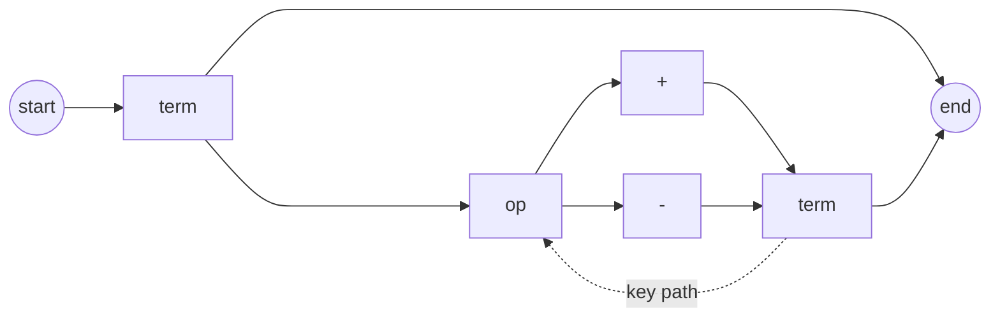

# Part 3
基于 Part 2 中的计算器，新增以下功能

- 支持处理包含多个加减运算的表达式

> Example: 
>
> 100 + 2、2+ 490 + 29 

## 语法图

```mermaid
graph LR
S((start)) --> T1[term]
T1 --------> E((end))
T1 --> OP[op]
OP --> + --> T2[term]
OP --> - --> T2
T2 -.key path..-> OP
T2 --> E

```

> 注：本节中的 term 就是一个整数
>
> 关键路径为 term 还可接到 op 上
