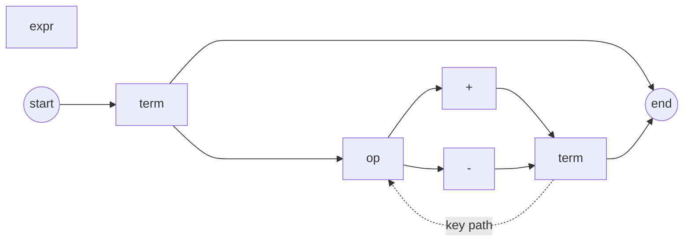
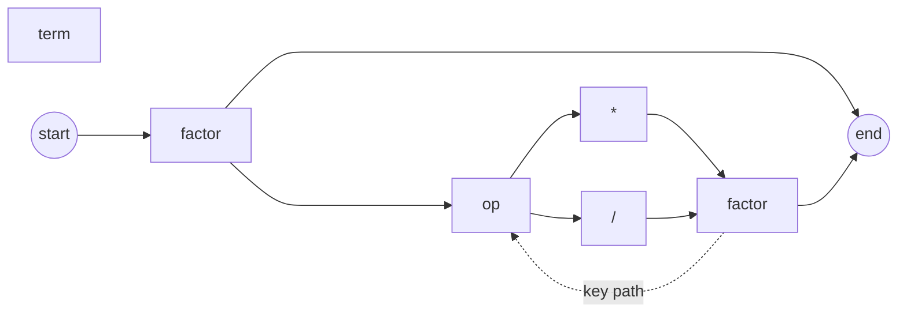
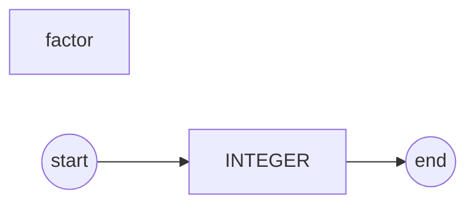

# Part 5

完善 Part 4 中的计算器，实现以下功能

- 支持处理四则运算

> Example: 
>
> 100 + 2 * 3、12 / 4 + 490 - 29 

## 定义运算符的优先级

| priority | op   | associativity |
| -------- | ---- | ------------- |
| 2        | * /  | left          |
| 1        | + -  | left          |

## 构造上下文无关语法

```text
expr   = term((PLUS|MINUS)term)*
term   = factor((MUL|DIV)factor)*
factor = INTEGER
```

## 构造语法图







## 实现

参照 part4 中的代码转化规则。
