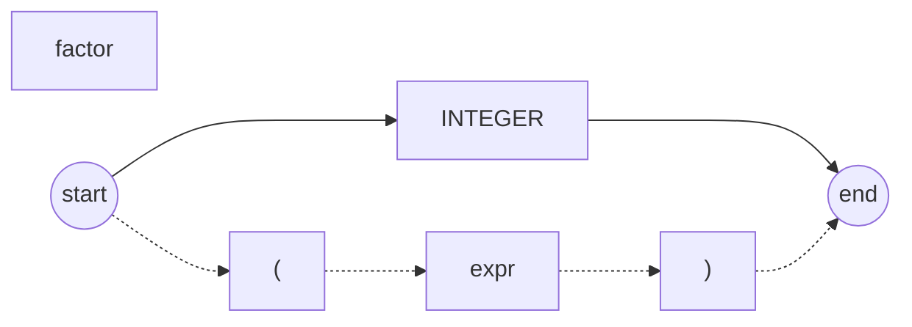

# Part 6

完善 Part 5 中的计算器，实现以下功能

- 支持处理嵌套括号

> Example: 
>
> (100 + 2) * 3、12 / 4 + (490 - 29)

## 构造上下文无关语法

```text
expr   = term((PLUS|MINUS)term)*
term   = factor((MUL|DIV)factor)*
factor = INTEGER|LPAREN expr RPAREN
```

## 语法图

>  这里只列举变更后的 factor



