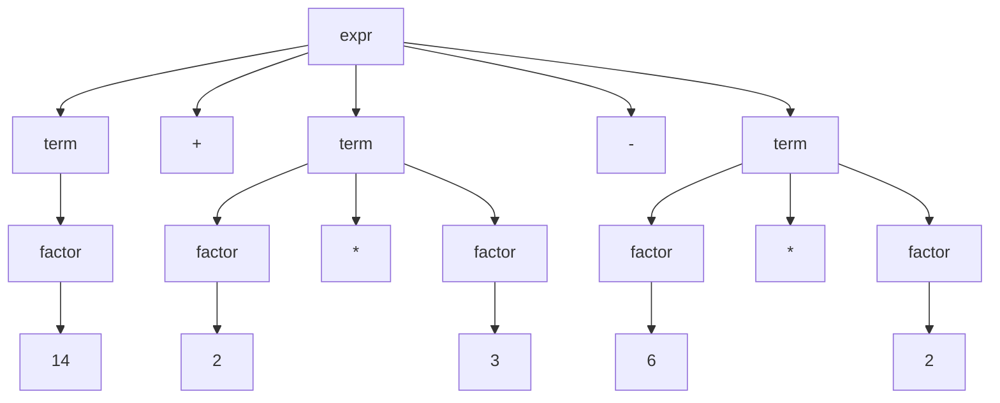
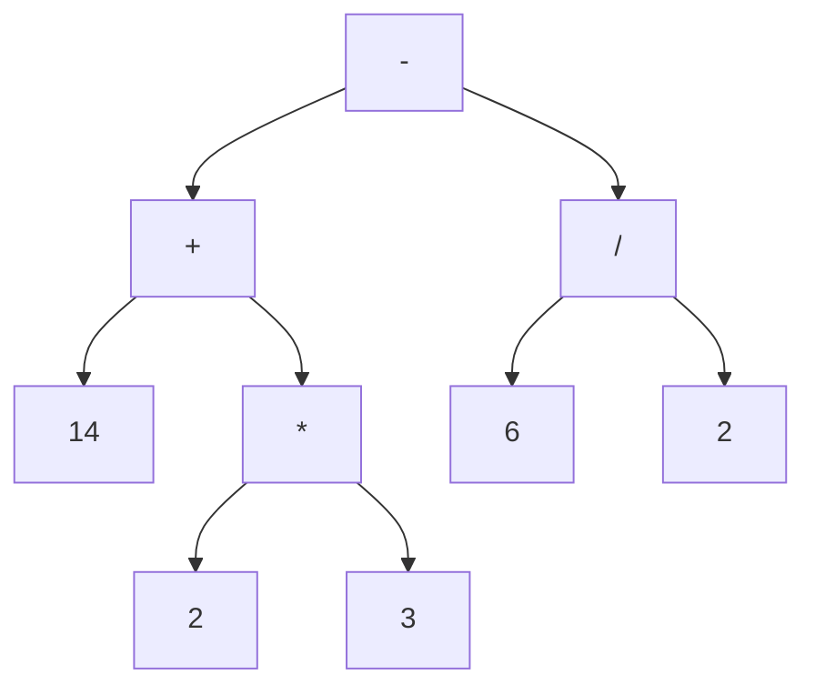

# Part 7

重构 Part 6 中的计算器，实现以下功能

> 将已有的 Lexer + Interpreter 架构拆分为 Lexer + Parser + Interpreter

## 背景

在之前的章节中，我们的解释器会在解释文本的同时，实时计算最终结果。

这种解释器一般被称为`语法制导`的解释器，通过对过程的分析，我们可以发现这种类型的解释器一般只会对输入进行一次性的处理，因此只适用于基础应用。

对于现实中更复杂的语言结构，我们需要将各种 Token 先构建为一个 IR（Intermediate Representation，即中间层）来进行处理，最后再交给 Interpreter 来处理 IR 去解释执行。

## IR 的数据结构

一般我们用两种树形结构来构建 IR：AST（抽象语法树）+ 解析树。

例如对于 “14 + 2 * 3 - 6 / 2”：

- 解析树



- AST



可以看到，AST 比解析树更精简，因此我们一般使用 AST 作为真实的数据结构，而解析树只是用来帮助我们理解。

> PS：对于有括号的情况，解析树更为复杂，而 AST 中不会包含括号（使用层级分布来实现运算顺序的区分）。


## 实现

我们将 part 6 中的 Interpreter 进行拆分，主要是做了以下两件事：

1. 将原有的 Token 遍历处理逻辑拆分出去，形成 `Parser`，同时将 `Parser` 处理后的产物替换为 `AST`，而非原有的 float64
2. 将原有的 Result 计算逻辑拆分出去，形成 `astVistor`，该结构主要用于以后序遍历的方式来处理 1 中产生的 `AST`，并在遍历过程中计算结果。
3. 基于上述两个结构体重新定义`Interpreter`:

``` go
type Interpreter struct {
  ps     *Parser
  vistor *astVisitor
}

func (it *Interpreter) Interpret() float64 {
  ast := it.ps.Parse()
  return it.vistor.visit(ast)
}
```

